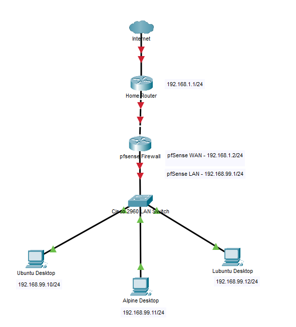

# Homelab

A hands-on networking homelab built using **Proxmox VE**, **pfSense**, **Ubuntu Server**, **Alpine Linux**, **Lubuntu**, and **Cisco Packet Tracer** to develop practical skills in Linux administration, networking, virtualization, and infrastructure management.

---

# Current Topology



---

# Project Goals

This homelab is designed to gain practical experience in:

- Linux Administration
- Network Engineering
- Virtualization
- Network Security
- DNS & DHCP Services
- VLAN Segmentation
- Infrastructure Documentation
- Troubleshooting
- Git & GitHub Workflow

---

# Technologies

- Proxmox VE
- pfSense CE
- Ubuntu Server
- Alpine Linux
- Lubuntu
- Cisco Packet Tracer
- BIND9 DNS
- SSH
- Git
- GitHub

---

# Documentation

| Phase | Description |
|--------|-------------|
| [01 - Proxmox Installation](docs/01-proxmox-installation.md) | Install and configure Proxmox VE |
| [02 - pfSense Installation](docs/02-pfsense-installation.md) | Deploy pfSense firewall |
| [03 - Ubuntu Server](docs/03-ubuntu-server.md) | Ubuntu Server installation and configuration |
| [04 - VLAN Configuration](docs/04-vlan-configuration.md) | VLAN planning and implementation |
| [05 - Firewall Rules](docs/05-firewall-rules.md) | Configure pfSense firewall rules |
| [06 - DHCP & DNS](docs/06-dhcp-dns.md) | DHCP services and network verification |
| [10 - Alpine Linux](docs/10-alpine-linux.md) | Alpine Linux deployment |
| [11 - Lubuntu Desktop](docs/11-lubuntu-desktop.md) | Lubuntu Desktop deployment |
| [12 - Local DNS Server](docs/12-dns-server.md) | Configure BIND9 DNS server |

---

# Cisco Packet Tracer

Before applying configurations to the virtual environment, the network is first designed and validated in Cisco Packet Tracer.

Packet Tracer is used to:

- Design the network topology
- Practice Cisco IOS commands
- Plan VLAN segmentation
- Validate Layer 2 and Layer 3 connectivity
- Reduce deployment errors before implementation

### Files

- [Packet Tracer Guide](packet-tracer/packet-tracer-guide.md)
- [Homelab Network](packet-tracer/homelab-network.pkt)

---

# Current Progress

## Infrastructure

- ✅ Proxmox VE
- ✅ pfSense Firewall
- ✅ Ubuntu Server
- ✅ Alpine Linux
- ✅ Lubuntu Desktop

## Networking

- ✅ Static IP Configuration
- ✅ SSH Remote Access
- ✅ VLAN Planning
- ✅ Firewall Rules
- ✅ DHCP
- ✅ Local DNS (BIND9)
- ✅ Internet DNS Forwarding
- 🔄 Inter-VLAN Routing

---

# Repository Structure

```text
Homelab/
│
├── diagrams/
├── docs/
├── packet-tracer/
├── screenshots/
├── scripts/
├── LICENSE
└── README.md
```

---

# Future Plans

- Inter-VLAN Routing
- Docker
- Pi-hole
- WireGuard VPN
- Network Monitoring
- Reverse Proxy
- Active Directory
- NAS
- Cloud Integration
- High Availability

---

# Author

**Pee Jay Juan**

Computer Engineering Student

Aspiring Network Engineer | Cloud Engineer

GitHub: https://github.com/Kuyapanyung