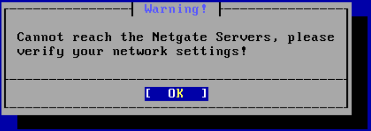
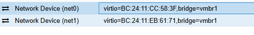

# pfSense Could Not Reach Netgate Servers

## Problem

During the initial pfSense installation, the installer displayed:

> Cannot reach the Netgate Servers, please verify your network settings!

### Screenshot



---

## Investigation

Upon reviewing the VM hardware configuration in Proxmox:



Both virtual network adapters were initially connected to the same bridge:

```text
net0 -> vmbr1
net1 -> vmbr1
```
