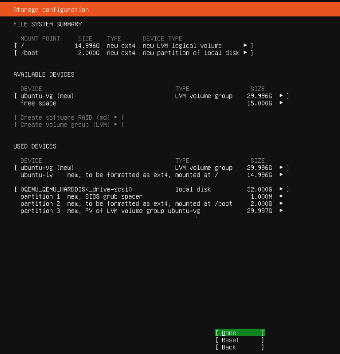
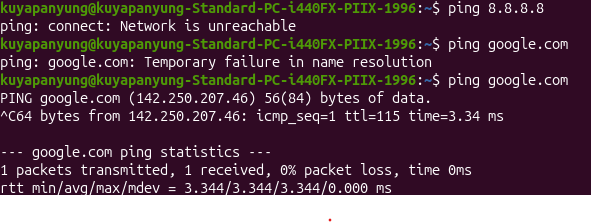
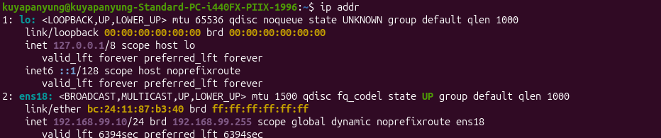
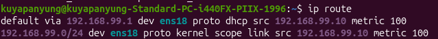
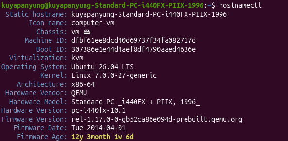
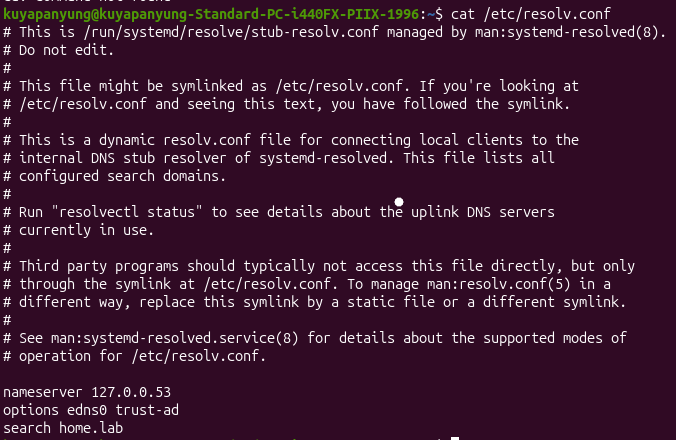
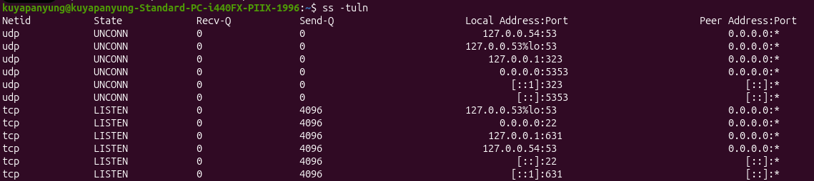
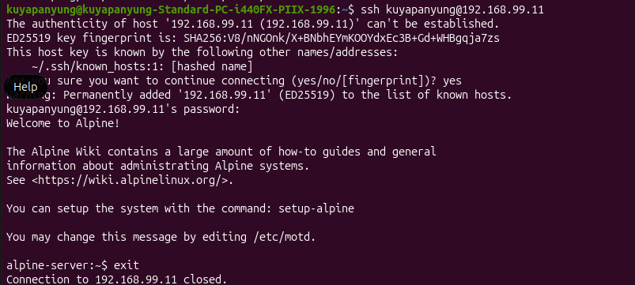

# Ubuntu Server Installation

## Objective

Deploy an Ubuntu Server virtual machine on Proxmox VE to serve as a Linux server for networking practice, Linux administration, SSH management, and future homelab services.

---

## VM Configuration

| Setting | Value |
|---------|-------|
| Hypervisor | Proxmox VE 9.1.1 |
| Guest OS | Ubuntu Server 26.04 LTS |
| CPU | 2 vCPU |
| Memory | 2 GB |
| Disk | 32 GB (VirtIO) |
| Network Adapter | VirtIO |

---

## Storage Configuration

The default LVM storage layout was selected during installation.

- Boot Partition: 2 GB (ext4)
- Root Filesystem: LVM (ext4)



---

## Profile Configuration

Created the initial administrator account during installation.

> **Note:** The password is intentionally omitted for security purposes.


---

# Network Connectivity Verification

After completing the installation, I verified the VM's network connectivity.

## Initial Test

```bash
ping 8.8.8.8
```

Result:

```text
ping: connect: Network is unreachable
```

Next, I tested DNS resolution.

```bash
ping google.com
```

Result:

```text
ping: google.com: Temporary failure in name resolution
```

---

## After Network Configuration

After correcting the network configuration, I tested again.

```bash
ping google.com
```

Result:

```text
64 bytes from google.com ...
0% packet loss
```

This confirmed:

- Internet connectivity was restored.
- DNS name resolution was functioning correctly.



---

# Linux Network Configuration

## Display Network Interfaces

The following command displays all network interfaces and their assigned IP addresses.

```bash
ip addr
```



---

## Display Routing Table

The routing table verifies the default gateway and connected networks.

```bash
ip route
```



---

## System Information

The `hostnamectl` command displays the hostname, operating system, kernel version, and system architecture.

```bash
hostnamectl
```



---

## DNS Configuration

The DNS resolver configuration was verified using:

```bash
cat /etc/resolv.conf
```

This confirms which DNS server is being used for hostname resolution.



---

## Verify Listening Services

The following command lists all listening TCP and UDP ports.

```bash
ss -tuln
```

This is useful for verifying active network services.



---

# SSH Configuration

SSH was enabled to allow secure remote administration of the Ubuntu Server.

Connection test:

```bash
ssh <username>@192.168.99.102
```

Successful authentication confirmed that the SSH service was operational and reachable over the local network.



---

# Summary

The Ubuntu Server virtual machine was successfully deployed and configured within the Proxmox homelab.

Completed tasks include:

- Ubuntu Server installation
- LVM storage configuration
- Administrator account creation
- Internet connectivity verification
- DNS verification
- Network interface verification
- Routing table verification
- System information verification
- SSH configuration and remote access testing

---

# Lessons Learned

- Verified network interfaces using `ip addr`.
- Verified routing information using `ip route`.
- Verified hostname and operating system details using `hostnamectl`.
- Verified DNS configuration using `/etc/resolv.conf`.
- Used `ss -tuln` to inspect listening services.
- Successfully configured SSH for remote administration.
- Distinguished between routing failures and DNS resolution failures during troubleshooting.