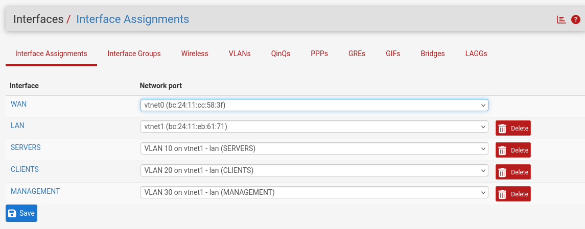

# VLAN Configuration

## Objective

Configure VLANs in pfSense to logically separate devices into different network segments for improved security, organization, and network management.

---

## VLAN Design

| VLAN | Name | Subnet |
|------|------|--------|
| 10 | Management | 192.168.10.0/24 |
| 20 | Servers | 192.168.20.0/24 |
| 30 | Clients | 192.168.30.0/24 |

---

## Interface Assignment

The VLAN interfaces were created and assigned in pfSense.

---

## Purpose of Each VLAN

### Management VLAN

Used for network administration and infrastructure devices.

### Server VLAN

Used for Linux servers and future self-hosted services.

### Client VLAN

Used for desktop operating systems and user devices.

---

## Lessons Learned

- Created multiple VLAN interfaces in pfSense.
- Assigned VLANs to separate network segments.
- Prepared the network for inter-VLAN routing and firewall rules.
- Improved network organization following enterprise networking practices.