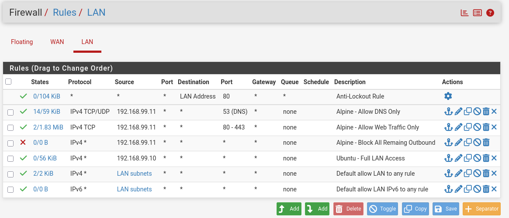
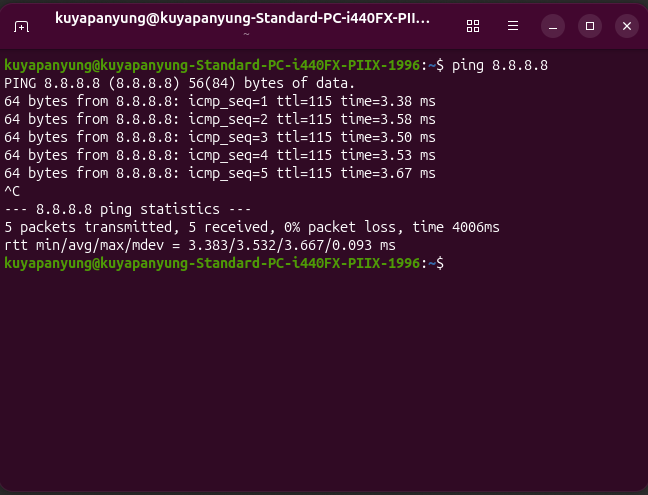
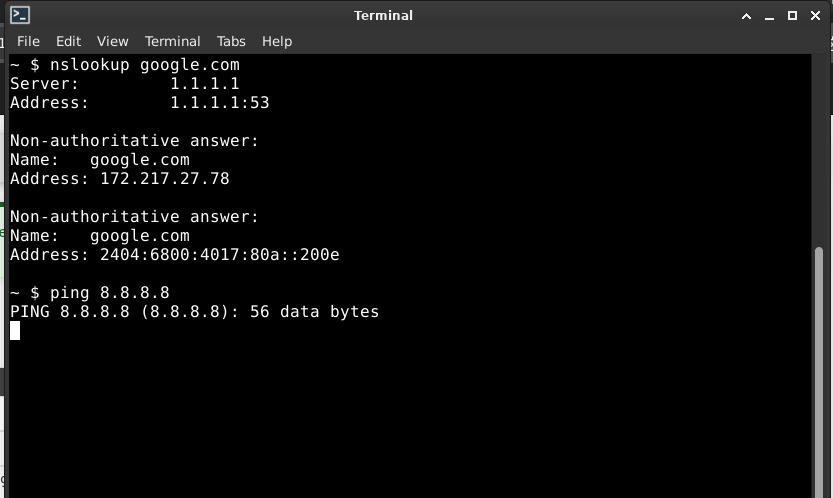

# pfSense Firewall Rules

## Objective

Verify the default pfSense firewall configuration and confirm that Ubuntu Server and Alpine Linux can communicate through the LAN.

---

## LAN Firewall Rules

The default LAN firewall rule was used, allowing outbound traffic from devices connected to the LAN network.

This configuration enables internal hosts to communicate with each other and access external networks.



---

## Firewall Verification - Ubuntu Server

Verified that Ubuntu Server could successfully communicate across the network.

Command:

```bash
ping 192.168.99.11
```

Result:

- Successful ICMP replies
- 0% packet loss
- Firewall permitted LAN traffic



---

## Firewall Verification - Alpine Linux

Verified that Alpine Linux could successfully communicate with Ubuntu Server.

Command:

```bash
ping 192.168.99.10
```

Result:

- Successful ICMP replies
- Stable network connectivity
- Firewall permitted LAN traffic



---

## Verification Summary

| Source | Destination | Result |
|---------|-------------|--------|
| Ubuntu Server | Alpine Linux | Successful |
| Alpine Linux | Ubuntu Server | Successful |

The successful ping tests confirmed that the pfSense firewall was correctly forwarding LAN traffic while maintaining network connectivity.

---

## Lessons Learned

- pfSense processes firewall rules from top to bottom.
- The default LAN rule allows outbound traffic unless modified.
- Firewall verification should be performed after network configuration changes.
- ICMP (ping) is a simple method to verify Layer 3 connectivity between hosts.