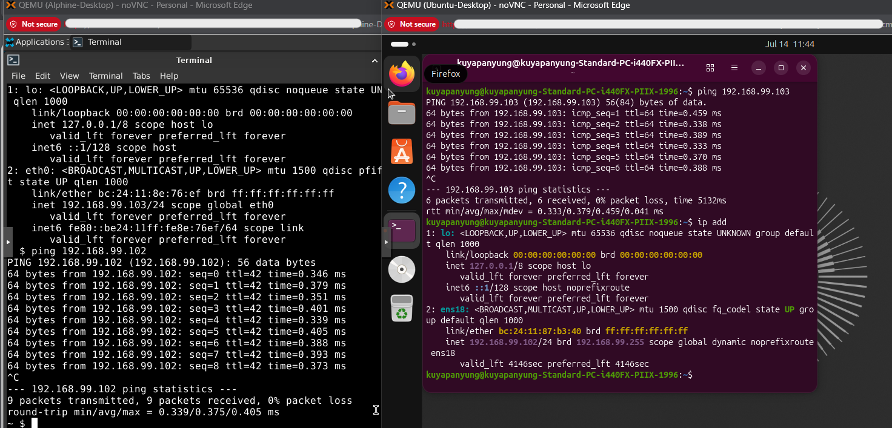

# DHCP Configuration

## IP Address Assignment

Ubuntu Server received:

- 192.168.99.102

Alpine Linux received:

- 192.168.99.103

Both virtual machines successfully obtained IP addresses from the pfSense DHCP server.

---

## Connectivity Verification

To verify Layer 3 connectivity, each VM successfully pinged the other.

Ubuntu:

```bash
ping 192.168.99.103
```

Alpine:

```bash
ping 192.168.99.102
```

Results:

- 0% packet loss
- Successful ICMP replies
- Stable latency


