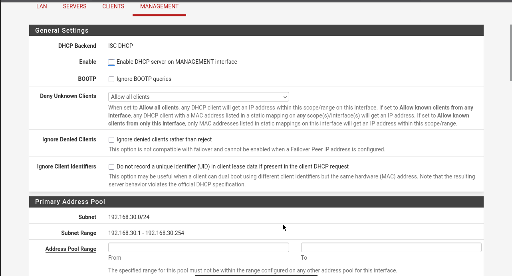
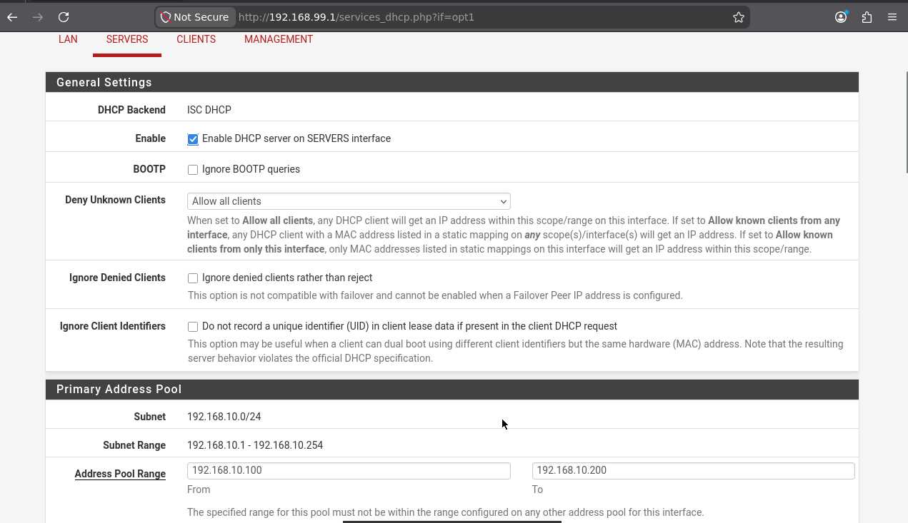
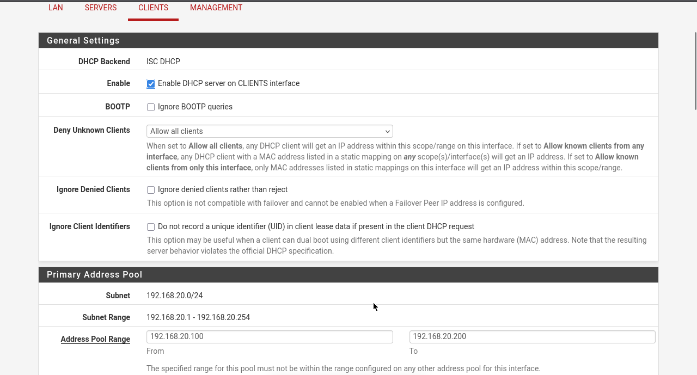
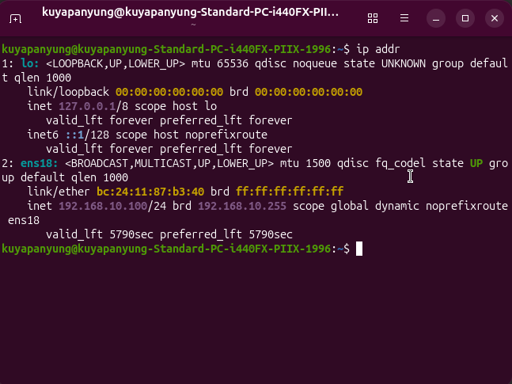
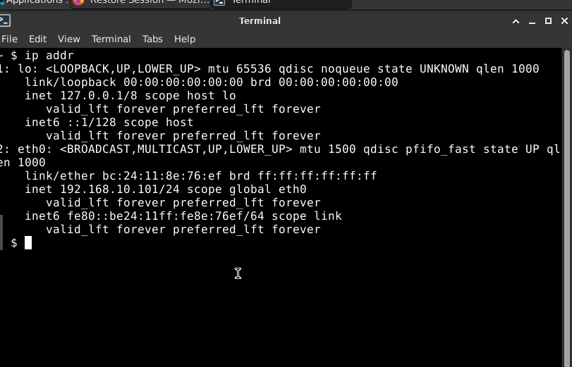
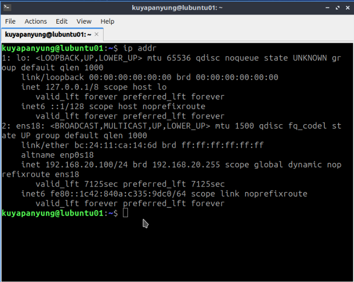

# DHCP and DNS Configuration

## Objective

Configure and verify DHCP and DNS services using pfSense for multiple Linux virtual machines across the homelab network.

---

# DHCP Configuration

## DHCP Server

pfSense was configured to provide DHCP services for the configured VLANs and client devices.

### Management VLAN



---

### Server VLAN



---

### Client VLAN



---

## Linux Client DHCP Verification

The following virtual machines successfully received IP addresses from the pfSense DHCP server.

### Ubuntu Desktop



---

### Alpine Linux



---

### Lubuntu Desktop



---

# Network Connectivity Verification

After DHCP configuration, connectivity between the Linux virtual machines was verified.

### Ubuntu Desktop

```bash
ping 192.168.99.11
ping 192.168.99.12
```

### Alpine Linux

```bash
ping 192.168.99.10
ping 192.168.99.12
```

### Lubuntu Desktop

```bash
ping 192.168.99.10
ping 192.168.99.11
```

All tests completed successfully with:

- 0% packet loss
- Successful ICMP replies
- Stable network latency

---

# DNS Verification

Internet connectivity and DNS resolution were verified from each Linux virtual machine.

```bash
ping google.com
```

Successful replies confirmed:

- Internet connectivity
- DNS resolution
- Correct default gateway configuration

---

# Summary

The pfSense firewall successfully provided:

- DHCP address assignment
- DNS resolution
- Default gateway configuration
- Internet connectivity
- Communication between Ubuntu Desktop, Alpine Linux, and Lubuntu Desktop

The virtual network was operating correctly after DHCP and DNS configuration.

---

# Lessons Learned

- Configured DHCP services using pfSense.
- Verified DHCP lease assignment for multiple Linux virtual machines.
- Confirmed DNS resolution using `ping google.com`.
- Verified communication between Linux virtual machines using ICMP.
- Validated Internet connectivity through the pfSense gateway.