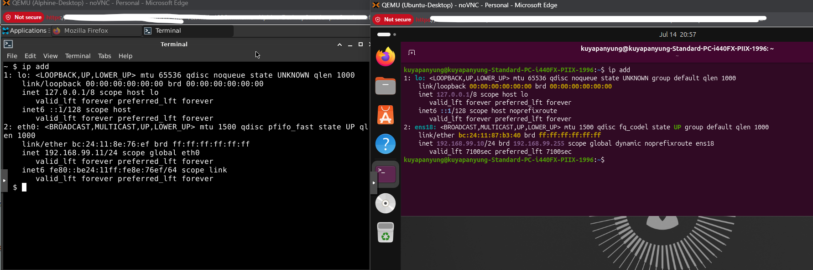
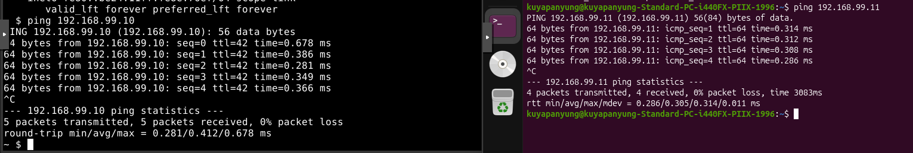
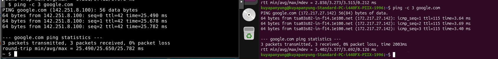

# DHCP and DNS Configuration

## Objective

Verify that pfSense successfully provides DHCP services, DNS resolution, and network connectivity to the Ubuntu Server and Alpine Linux virtual machines.

---

# DHCP Configuration

## IP Address Assignment

Both virtual machines successfully obtained IP addresses from the pfSense DHCP server.

| Virtual Machine | IP Address |
|-----------------|------------|
| Ubuntu Server | 192.168.99.102 |
| Alpine Linux | 192.168.99.103 |



---

# Network Connectivity Verification

## VM-to-VM Communication

To verify Layer 3 connectivity, each virtual machine successfully communicated with the other using ICMP.

### Ubuntu Server

```bash
ping 192.168.99.103
```

### Alpine Linux

```bash
ping 192.168.99.102
```

Results:

- 0% packet loss
- Successful ICMP replies
- Stable network latency



---

# DNS Verification

Verified DNS name resolution from both Ubuntu Server and Alpine Linux.

```bash
ping google.com
```

Successful replies confirmed:

- Internet connectivity
- Proper DNS resolution
- Correct gateway configuration



---

# Summary

The pfSense firewall successfully provided:

- DHCP address assignment
- Default gateway configuration
- DNS resolution
- Internet connectivity
- Communication between virtual machines

This verified that the virtual network was functioning correctly.

---

# Lessons Learned

- Verified DHCP address assignment from pfSense.
- Confirmed successful DNS resolution using `ping google.com`.
- Verified Layer 3 connectivity using ICMP.
- Confirmed communication between Ubuntu Server and Alpine Linux.
- Validated the overall virtual network configuration.