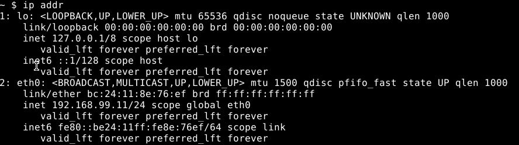
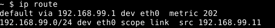
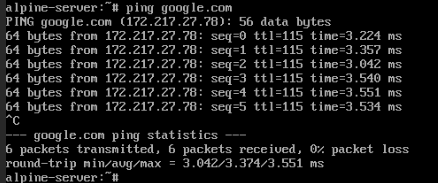
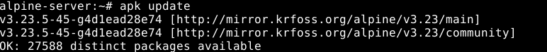
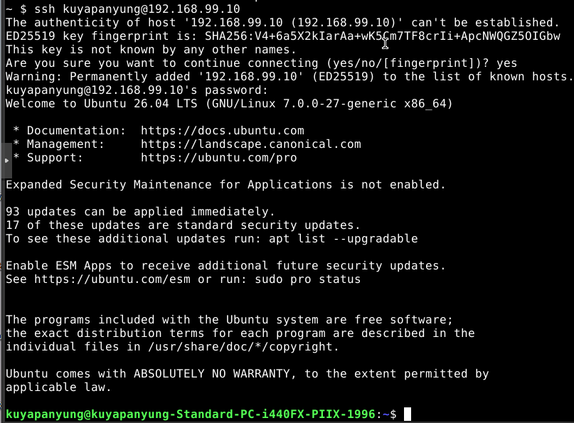
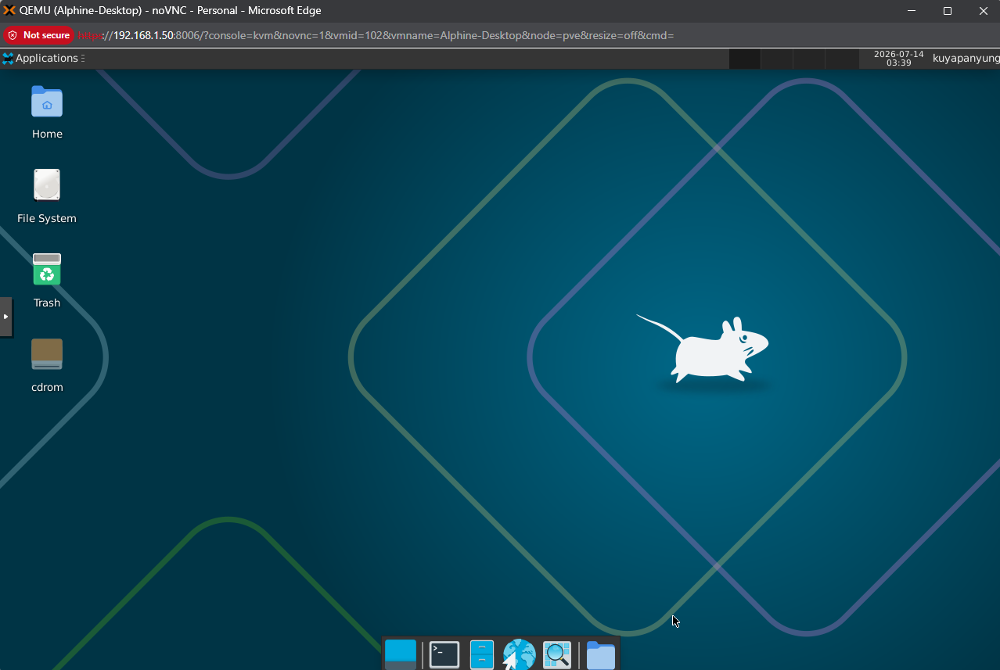

# Alpine Linux Installation

## Objective

Deploy Alpine Linux as a lightweight virtual machine to practice Linux administration, networking, package management, and SSH within the Proxmox homelab.

---

## VM Configuration

| Setting | Value |
|---------|-------|
| Hypervisor | Proxmox VE 9.1.1 |
| Guest OS | Alpine Linux 3.23 |
| CPU | 1 vCPU |
| Memory | 512 MB |
| Disk | 8 GB |
| Network Adapter | VirtIO |

---

# Network Configuration

## IP Address

Verified the assigned IP address after installation.

```bash
ip addr
```



---

## Routing Table

Verified the default gateway and connected network.

```bash
ip route
```



---

# Internet Connectivity

Verified Internet connectivity and DNS resolution.

```bash
ping google.com
```

Successful replies confirmed:

- Internet connectivity
- DNS resolution
- Proper network configuration



---

# Package Management

Updated the package repository using Alpine's package manager.

```bash
apk update
```

This ensures the latest package indexes are available before installing software.



---

# SSH Configuration

Verified secure remote administration using SSH.

Example connection:

```bash
ssh alpine@192.168.99.103
```

Successful authentication confirmed that the SSH service was accessible from another machine on the local network.



---

# Remote Access Verification

Verified remote access between systems in the homelab.

This confirms that the Alpine Linux virtual machine can be managed remotely over the network.



---

# Summary

The Alpine Linux virtual machine was successfully deployed and configured within the Proxmox homelab.

Completed tasks include:

- Alpine Linux installation
- Network configuration verification
- Routing table verification
- Internet connectivity testing
- Package repository update
- SSH configuration and remote administration
- Remote connectivity verification

---

# Lessons Learned

- Alpine Linux is a lightweight Linux distribution based on BusyBox.
- Uses `apk` as its package manager.
- Verified IP address configuration using `ip addr`.
- Verified routing information using `ip route`.
- Updated package repositories using `apk update`.
- Successfully configured SSH for remote administration.
- Confirmed Internet connectivity and DNS resolution.
- Alpine Linux is well suited for lightweight servers, containers, and networking laboratories.