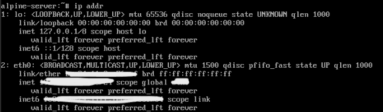
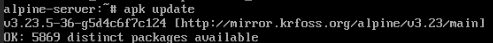

# Alpine Linux Installation

## Objective

Deploy Alpine Linux as a lightweight virtual machine to practice Linux administration and networking.

---

## VM Configuration

| Setting | Value |
|---------|-------|
| Hypervisor | Proxmox VE |
| Guest OS | Alpine Linux 3.23 |
| CPU | 1 vCPU |
| Memory | 512 MB |
| Disk | 8 GB |
| Network | VirtIO |

---

## Network Configuration

Verified the assigned IP address after installation.

```bash
ip addr
```



---

## Internet Connectivity

Verified Internet connectivity and DNS resolution.

```bash
ping google.com
```


---

## Package Management

Updated the package repository using Alpine's package manager.

```bash
apk update
```



---

## Lessons Learned

- Alpine Linux is a lightweight distribution based on BusyBox.
- Uses `apk` as its package manager.
- Suitable for containers, lightweight servers, and networking labs.