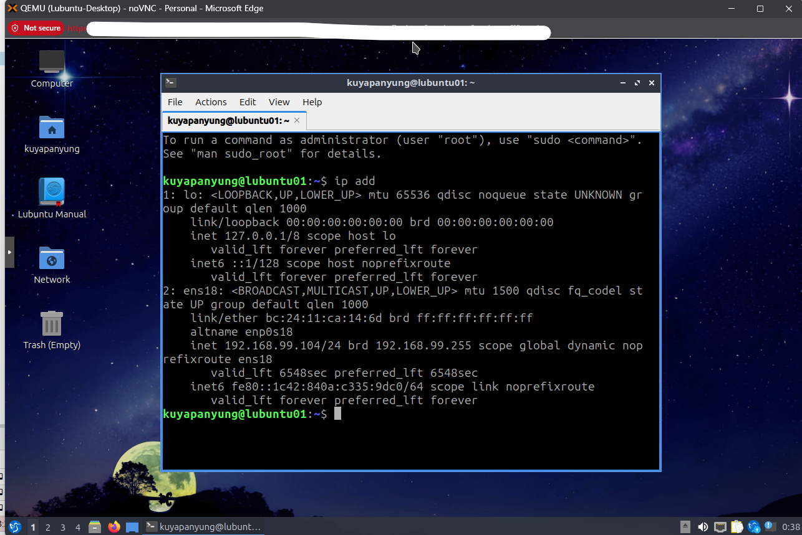
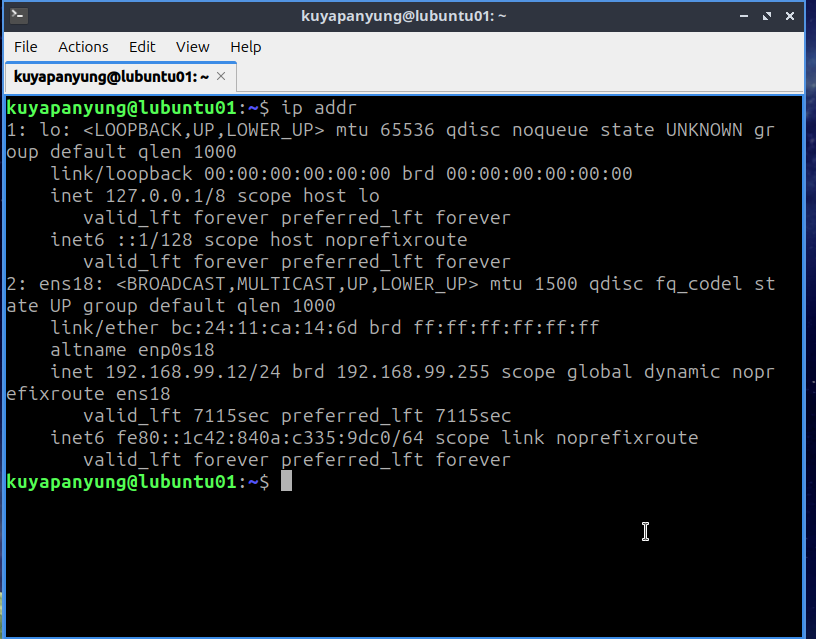
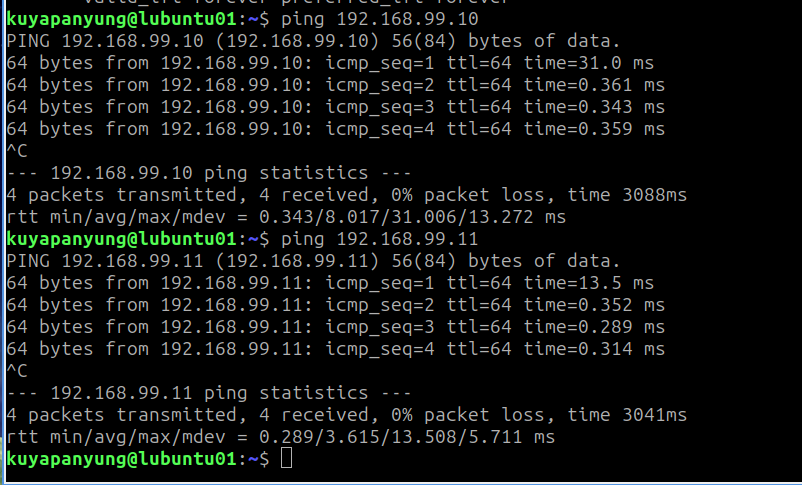

# Lubuntu Desktop Installation

## Objective

Deploy a Lubuntu Desktop virtual machine on Proxmox to provide a lightweight Linux desktop environment for testing network connectivity, SSH access, and client-side administration within the homelab.

---

## VM Configuration

| Setting | Value |
|---------|-------|
| Hypervisor | Proxmox VE 9.1.1 |
| Guest OS | Lubuntu |
| CPU | 2 vCPU |
| Memory | 2 GB |
| Disk | 32 GB |
| Network Adapter | VirtIO |

---

## DHCP Configuration

After installation, the Lubuntu VM successfully obtained an IP address from the pfSense DHCP server.

**Verification**

```bash
ip addr
```

This confirmed that the virtual machine received a valid IP address and could communicate on the LAN.



---

## Static IP Configuration

The network interface was configured with a static IP address for easier management and consistent connectivity.

| Setting | Value |
|---------|-------|
| Interface | ens18 |
| IP Address | 192.168.99.12/24 |
| Gateway | 192.168.99.1 |
| DNS Server | 8.8.8.8, 1.1.1.1 |

Verification:

```bash
ip addr
ip route
```



---

## Network Connectivity Verification

After assigning the static IP address, connectivity between all Linux virtual machines was verified.

Tested connectivity:

```bash
ping 192.168.99.10
ping 192.168.99.11
ping google.com
```

Results:

- Successful communication with Ubuntu Desktop
- Successful communication with Alpine Linux
- Successful Internet connectivity
- Successful DNS resolution



---

## Lessons Learned

- Installed a lightweight Linux desktop environment using Lubuntu.
- Verified DHCP address assignment from the pfSense DHCP server.
- Configured a static IPv4 address using NetworkManager.
- Verified routing and Internet connectivity.
- Confirmed communication between Ubuntu Desktop, Alpine Linux, and Lubuntu Desktop within the same LAN.