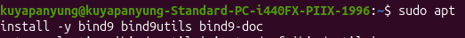
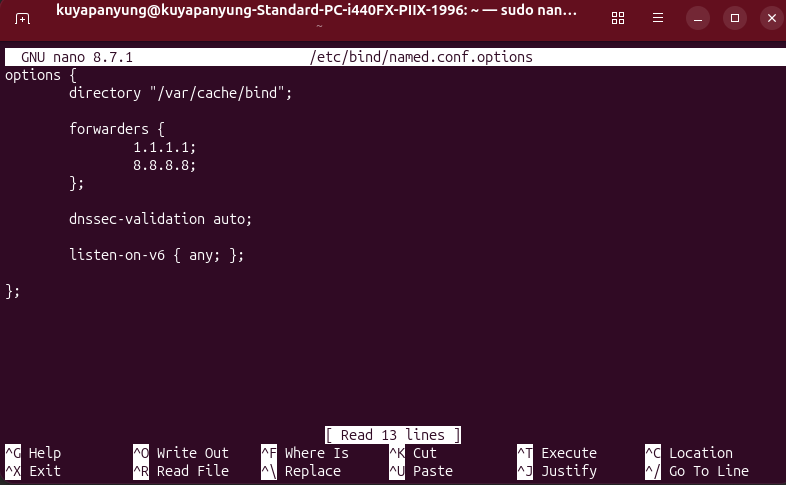
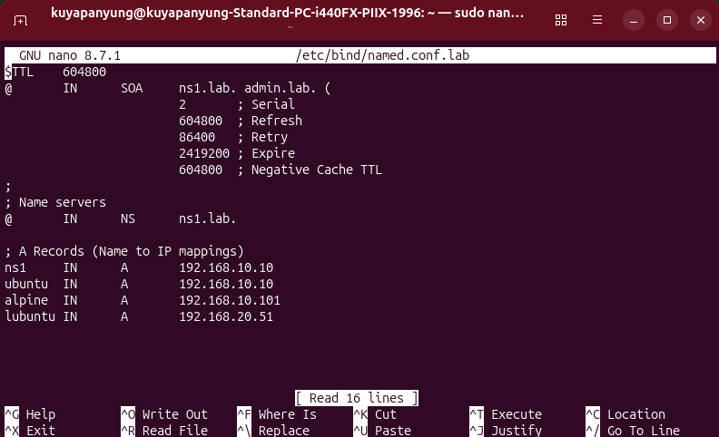
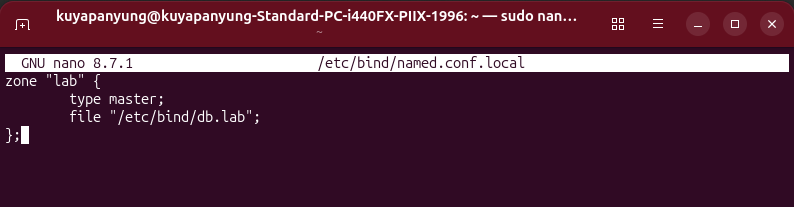
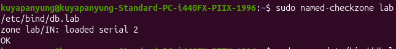
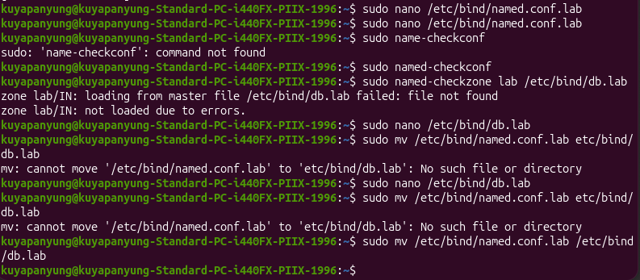
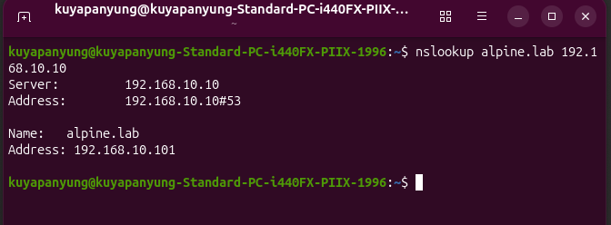
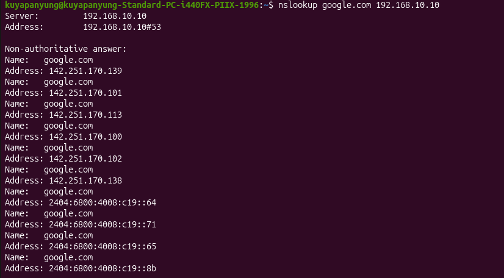

# Local DNS Server (BIND9)

## Objective

Deploy a local DNS server using **BIND9** on Ubuntu Server to provide hostname resolution for devices inside the homelab.

Instead of accessing devices using IP addresses, clients can communicate using hostnames such as:

- ubuntu.lab
- alpine.lab
- lubuntu.lab

---

# Environment

| Component | Value |
|-----------|-------|
| DNS Server | Ubuntu Server |
| DNS Software | BIND9 |
| Domain | lab |
| Server IP | 192.168.10.10 |

---

# Installing BIND9

Installed the required BIND9 packages.

```bash
sudo apt install -y bind9 bind9utils bind9-doc
```



---

# Configure DNS Forwarders

Configured external DNS forwarders to resolve Internet domains.

Forwarders used:

- 8.8.8.8
- 1.1.1.1



---

# Create the Local DNS Zone

Created a new DNS zone named **lab** inside:

```
/etc/bind/named.conf.local
```



---

# Configure DNS Records

Created the zone database containing host records.

Configured hosts:

| Hostname | IP Address |
|----------|------------|
| ns1.lab | 192.168.10.10 |
| ubuntu.lab | 192.168.10.10 |
| alpine.lab | 192.168.10.101 |
| lubuntu.lab | 192.168.20.51 |



---

# Validate Configuration

Verified the DNS zone before restarting BIND.

```bash
sudo named-checkzone lab /etc/bind/db.lab
```

Result:

```
OK
```



---

# Troubleshooting

During configuration, an incorrect filename prevented the DNS zone from loading.

The issue was resolved by correcting the file name and validating the configuration again.



---

# DNS Resolution Testing

Verified hostname resolution for local devices.

### Local Host

```bash
nslookup alpine.lab 192.168.10.10
```



---

### Internet Name Resolution

Verified that external domains could also be resolved through the DNS forwarder.

```bash
nslookup google.com 192.168.10.10
```



---

# Summary

Successfully configured a local BIND9 DNS server capable of:

- Hosting a private DNS zone
- Resolving internal hostnames
- Forwarding Internet DNS requests
- Validating zone configuration
- Providing centralized name resolution for the homelab

---

# Lessons Learned

- Installed and configured BIND9.
- Created a custom DNS zone.
- Configured A records for local hosts.
- Configured DNS forwarding.
- Used `named-checkconf` and `named-checkzone` to validate configuration.
- Used `nslookup` to verify both local and Internet name resolution.