# Packet Tracer — DHCP Configuration

## Objective

Configure the Dynamic Host Configuration Protocol (DHCP) service on the simulated pfSense router to automatically assign IP addresses to devices in each VLAN. Verify that all end devices receive the correct network configuration and can successfully communicate within and across VLANs.

---

# Network Overview

The Packet Tracer topology consists of three VLANs:

| VLAN | Purpose | Network |
|------|---------|----------------|
| VLAN 10 | Servers | 192.168.10.0/24 |
| VLAN 20 | Clients | 192.168.20.0/24 |
| VLAN 30 | Management | 192.168.30.0/24 |

---

# Step 1 — Configure Router Subinterfaces

Configured Router-on-a-Stick by creating subinterfaces for each VLAN on the pfSense router.

Configured interfaces:

- GigabitEthernet0/1.10
- GigabitEthernet0/1.20
- GigabitEthernet0/1.30

Each subinterface was assigned the default gateway address for its respective VLAN.

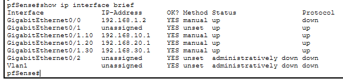

---

# Step 2 — Configure VLAN Gateway Interfaces

Assigned gateway IP addresses that will serve as the default gateway for each VLAN.

| VLAN | Gateway Address |
|------|-----------------|
| VLAN 10 | 192.168.10.1 |
| VLAN 20 | 192.168.20.1 |
| VLAN 30 | 192.168.30.1 |

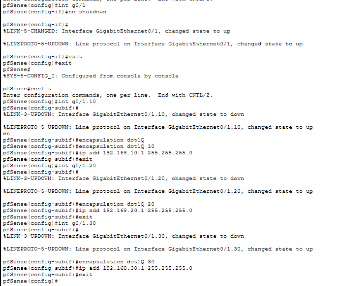

---

# Step 3 — Configure DHCP Pools

Created separate DHCP pools for each VLAN to automatically assign IP addresses to connected devices.

Each DHCP pool contains:

- Network Address
- Default Gateway
- DNS Server
- IP Address Range

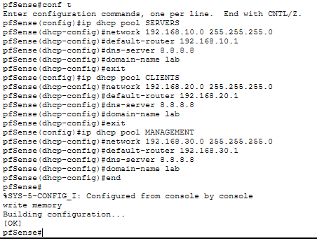

---

# Step 4 — Exclude Gateway Addresses

Excluded the gateway IP addresses from the DHCP pools to prevent duplicate IP address assignments.

Excluded addresses:

- 192.168.10.1
- 192.168.20.1
- 192.168.30.1

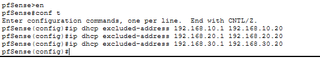

---

# Step 5 — Configure Switch Ports

Configured switch access ports according to their designated VLANs.

Example assignments:

- Ubuntu Server → VLAN 10
- Alpine Linux → VLAN 10
- Lubuntu Desktop → VLAN 20
- Management PC → VLAN 30

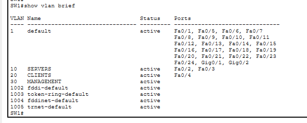

---

# Step 6 — Configure Trunk Port

Configured the switch uplink connected to the pfSense router as an IEEE 802.1Q trunk.

Allowed VLANs:

- VLAN 10
- VLAN 20
- VLAN 30

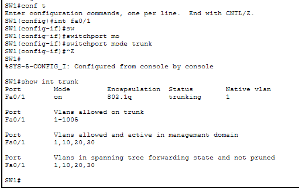

---

# Step 7 — Verify DHCP Bindings

Verified that each client successfully obtained an IP address from the correct DHCP pool.

Verification confirmed that:

- Devices received the expected IP address.
- The correct subnet mask was assigned.
- The correct default gateway was assigned.
- DHCP leases were successfully created.

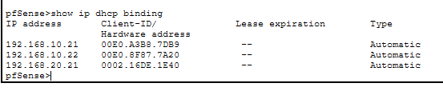

---

# Step 8 — Verify Network Connectivity

Performed connectivity tests to validate the DHCP configuration.

Tests included:

- Client → Default Gateway
- Client → Server VLAN
- Inter-VLAN Communication

Results:

- Successful ICMP replies
- No packet loss
- Correct Layer 3 routing

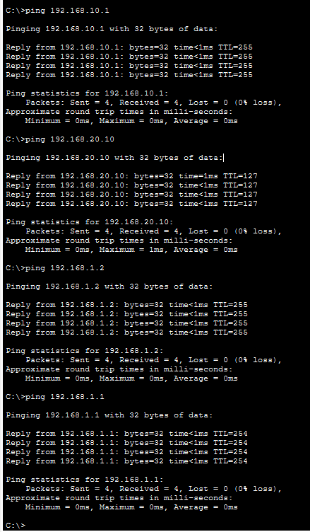

---

# Step 9 — Verify Server VLAN Communication

Verified that devices could successfully communicate with servers located in VLAN 10.

This confirms that DHCP, VLAN configuration, and inter-VLAN routing are functioning correctly.

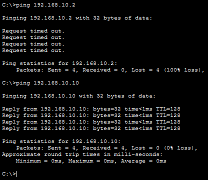

---

# Step 10 — Configure Static Routes

Configured static routes on the Home Router to allow communication with the internal VLAN networks through the pfSense router.

Configured routes:

- 192.168.10.0/24
- 192.168.20.0/24
- 192.168.30.0/24

Configuration Screenshot:

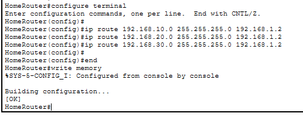

Verification Screenshot:

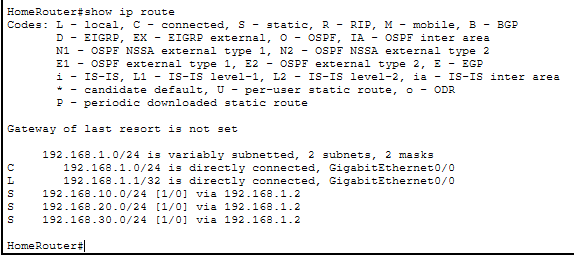

---

# Summary

The DHCP implementation was successfully completed.

The following components were successfully configured and verified:

- Router-on-a-Stick
- VLAN gateway interfaces
- DHCP pools
- Gateway exclusion
- Switch access ports
- IEEE 802.1Q trunking
- Automatic IP address assignment
- DHCP bindings
- Inter-VLAN routing
- Static routing between the Home Router and pfSense
- End-to-end network connectivity

---

# Lessons Learned

Through this activity, I learned how to:

- Configure DHCP pools for multiple VLANs.
- Reserve gateway addresses using DHCP exclusions.
- Configure Router-on-a-Stick using router subinterfaces.
- Implement VLAN segmentation in a switched network.
- Configure IEEE 802.1Q trunk links.
- Verify DHCP bindings and IP address assignments.
- Test Layer 3 connectivity using ICMP.
- Configure static routes between routers.
- Troubleshoot DHCP and routing issues using Cisco IOS commands.

---

# Conclusion

This Packet Tracer activity successfully simulated a multi-VLAN enterprise network with centralized DHCP services. All end devices were able to obtain valid IP addresses automatically, communicate within their assigned VLANs, and access devices on other VLANs through inter-VLAN routing.

This simulation serves as a practice environment before implementing the same concepts in my physical Proxmox and pfSense homelab.