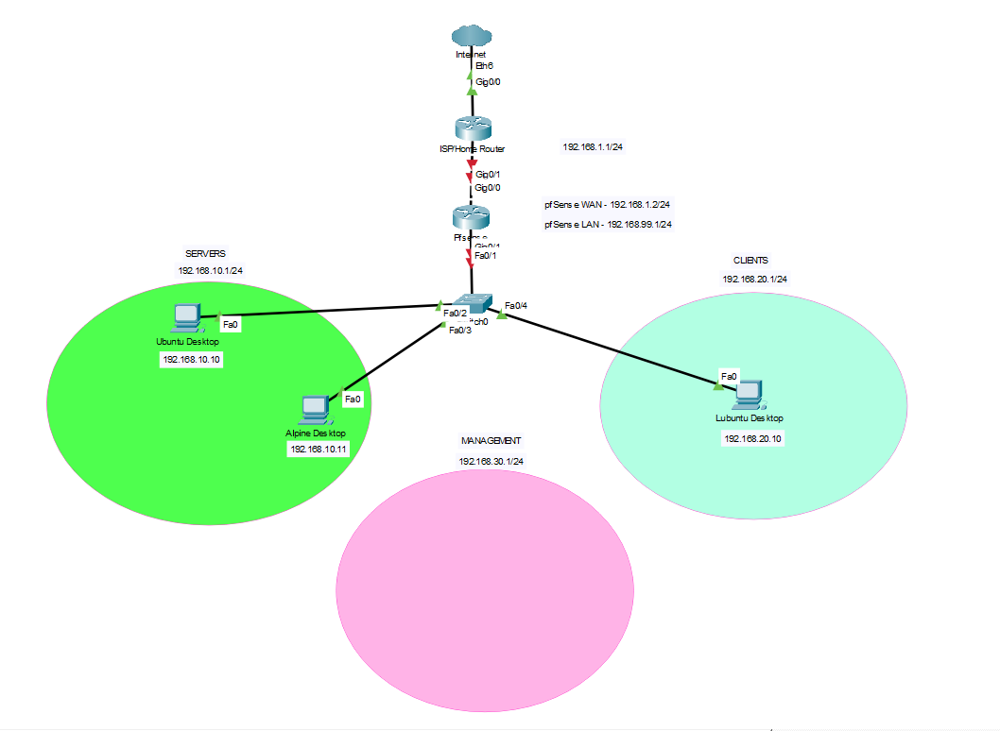
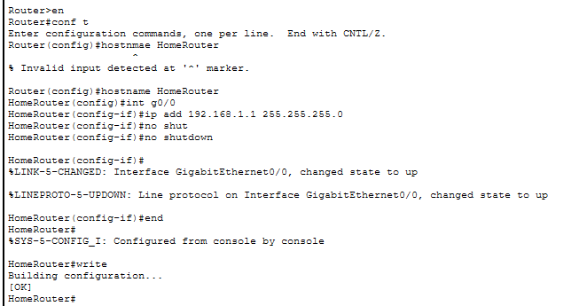
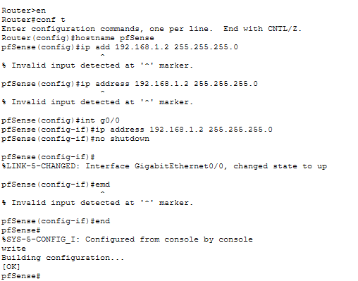
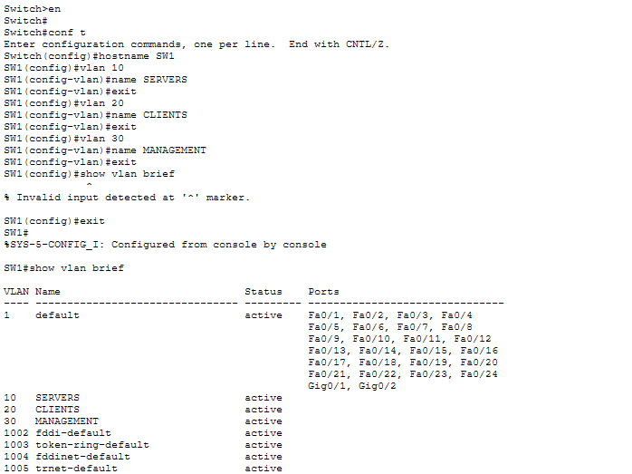

# Cisco Packet Tracer Network Simulation

## Objective

Before applying configurations to my physical homelab, I first designed and tested the network using Cisco Packet Tracer.

This allows me to:

- Understand networking concepts before deployment
- Verify configurations in a safe environment
- Reduce configuration mistakes
- Build confidence before implementing on Proxmox and pfSense

---

# Network Topology

The simulated network consists of:

- Internet
- Home Router
- pfSense Firewall
- Cisco 2960 Switch
- Ubuntu Desktop
- Alpine Linux
- Lubuntu Desktop

Network segmentation:

| VLAN | Purpose | Network |
|------|----------|----------------|
| VLAN 10 | Servers | 192.168.10.0/24 |
| VLAN 20 | Clients | 192.168.20.0/24 |
| VLAN 30 | Department | 192.168.30.0/24 |

---

# Home Router Configuration

The Home Router simulates the ISP gateway and provides connectivity to the pfSense firewall.

Configuration completed:

- Assigned WAN network
- Configured gateway
- Enabled router interfaces

---

# pfSense Router Configuration

A Cisco router is used to simulate pfSense firewall behavior inside Packet Tracer.

Configuration includes:

- WAN Interface
- LAN Interface
- Default Gateway
- Interface activation

Planned future configuration:

- VLAN interfaces
- DHCP
- Firewall rules

---

# Switch Port Configuration

Configured the Cisco 2960 switch to connect end devices.

Tasks performed:

- Assigned access ports
- Connected Ubuntu
- Connected Alpine
- Connected Lubuntu
- Prepared trunk connection to pfSense

---

# VLAN Configuration

Created VLANs to logically separate the network.

Configured VLANs:

| VLAN | Name |
|------|------|
| 10 | Servers |
| 20 | Clients |
| 30 | Department |

This segmentation prepares the network for inter-VLAN routing through pfSense.

---

# Skills Practiced

- Network topology design
- Cisco IOS CLI
- VLAN creation
- Access port configuration
- Network segmentation
- Enterprise network planning

---

# Lessons Learned

- Packet Tracer provides a safe environment to practice networking concepts.
- VLANs improve organization and security by separating network traffic.
- Simulating the network before deployment reduces configuration errors.
- Planning the network architecture simplifies the implementation on the actual homelab.
- Documentation is just as important as the configuration itself for troubleshooting and future reference.

---

# Next Steps

After validating the design in Packet Tracer, the same configuration will be implemented in the physical homelab using:

- Proxmox VE
- pfSense Firewall
- Ubuntu Desktop
- Alpine Linux
- Lubuntu Desktop

Future implementations include:

- VLAN trunking
- Inter-VLAN routing
- DHCP per VLAN
- Firewall rules
- SSH management
- Network monitoring